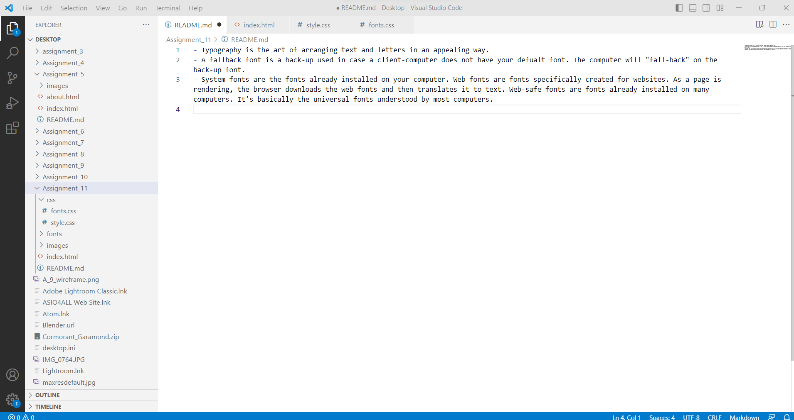

- Typography is the art of arranging text and letters in an appealing way.
- A fallback font is a back-up used in case a client-computer does not have your defualt font. The computer will "fall-back" on the back-up font.
- System fonts are the fonts already installed on your computer. Web fonts are fonts specifically created for websites. As a page is rendering, the browser downloads the web fonts and then translates it to text. Web-safe fonts are fonts already installed on many computers. It's basically the universal fonts understood by most computers. 
