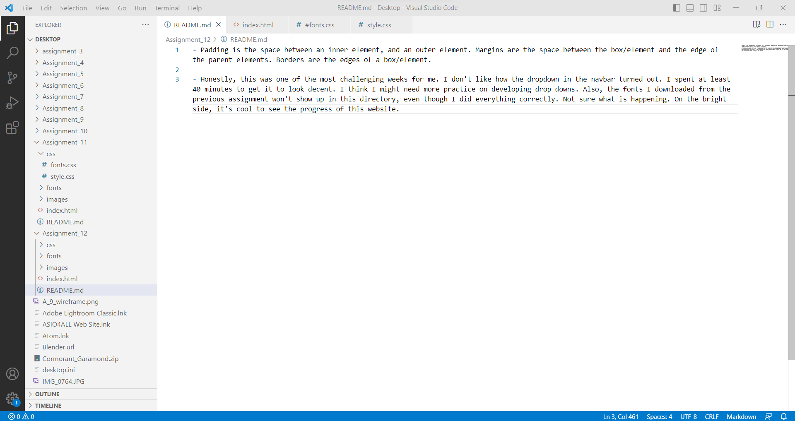

- Padding is the space between an inner element, and an outer element. Margins are the space between the box/element and the edge of the parent elements. Borders are the edges of a box/element.

- Honestly, this was one of the most challenging weeks for me. I don't like how the dropdown in the navbar turned out. I spent at least 40 minutes to get it to look decent. I think I might need more practice on developing drop downs. Also, the fonts I downloaded from the previous assignment won't show up in this directory, even though I did everything correctly. Not sure what is happening. On the bright side, it's cool to see the progress of this website. 

