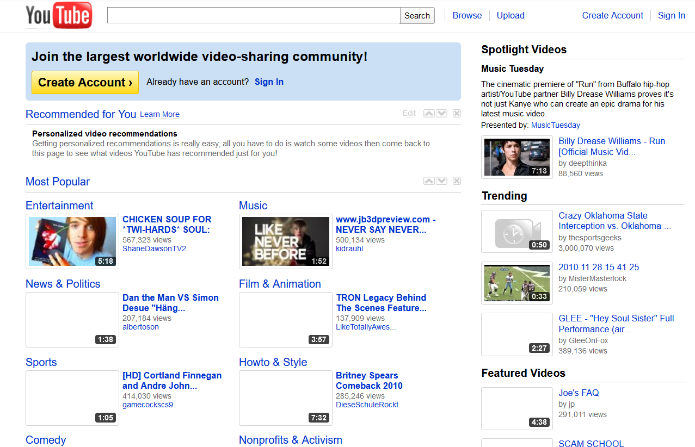

I used the Wayback Machine to see what Youtube looked like in 2010, and it was just how I remembered it as a kid. It's really interesting to see the recommended videos, because at the time that was the current news and culture. Now it's just a part of our history. Youtube has changed a lot since then, minus some things. The search bar and logo are still at the top, but now there's new features, such as a list of your subscriptions, shorts, liked videos, etc. Youtube has algorithms set in place that records down what you search, and then suggests videos according to your interests at the top of the page when you first open it. I kind of miss being suggested random videos outside of my interests. I'm not learning as much new things as I used to. I keep getting spammed with videos similar to other videos I've already watched...

To add on to the algorithms, Youtube videos are now bombarded with video advertisements. This is because the information that the algorithm records down is given to companies so that they can send you advertisements about their content or products. Algorithms have been used to increase consumerism, and it's gotten to a point now where consumerism is at an all time high. Before, there used to be advertisement banners on the side of the page which was fine because the videos where uninterrupted. Now there's ads that play before and after a video, and sometimes during the middle. Unless you pay for Youtube premium, you will have to suffer watching perpetual ads. The internet has become a dull place because of increased consumerism, in my opinion.

