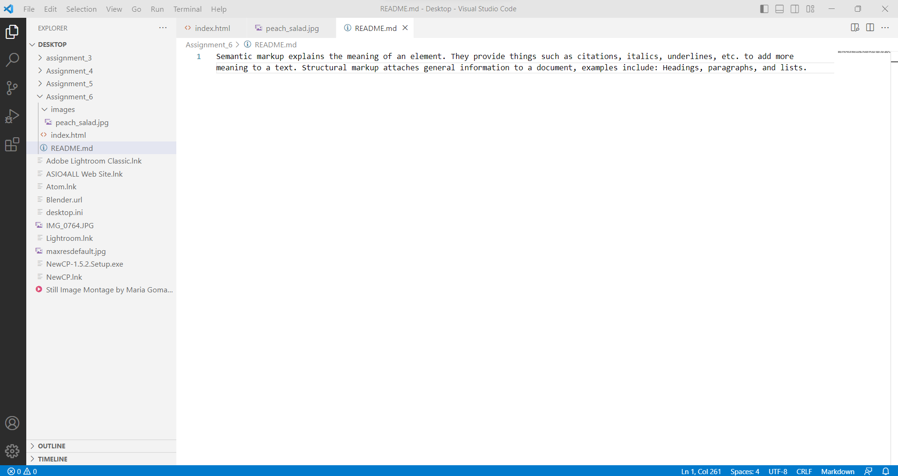

Semantic markup explains the meaning of an element. They provide things such as citations, italics, underlines, etc. to add more meaning to a text. Structural markup attaches general information to a document, examples include: Headings, paragraphs, and lists.

