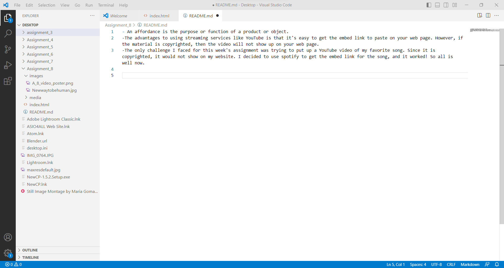

- An affordance is the purpose or function of a product or object.

- The advantages to using streaming services like YouTube is that it's easy to get the embed link to paste on your web page. However, if the material is copyrighted, then the video will not show up on your web page.

- The only challenge I faced for this week's assignment was trying to put up a YouTube video of my favorite song. Since it is copyrighted, it would not show on my website. I decided to use spotify to get the embed link for the song, and it worked! So all is well now.

