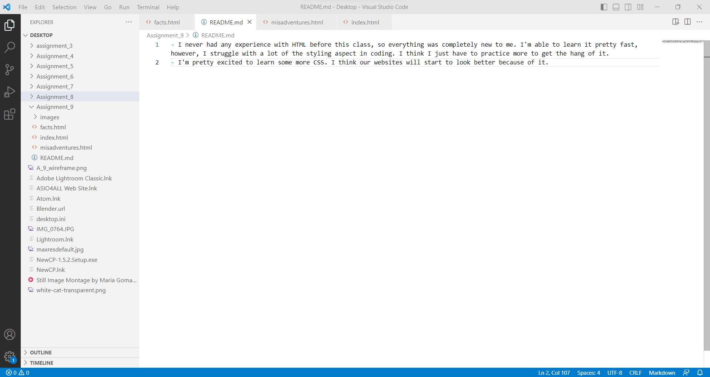

- I never had any experience with HTML before this class, so everything was completely new to me. I'm able to learn it pretty fast, however, I struggle with a lot of the styling aspect in coding. I think I just have to practice more to get the hang of it.
- I'm pretty excited to learn some more CSS. I think our websites will start to look better because of it.

