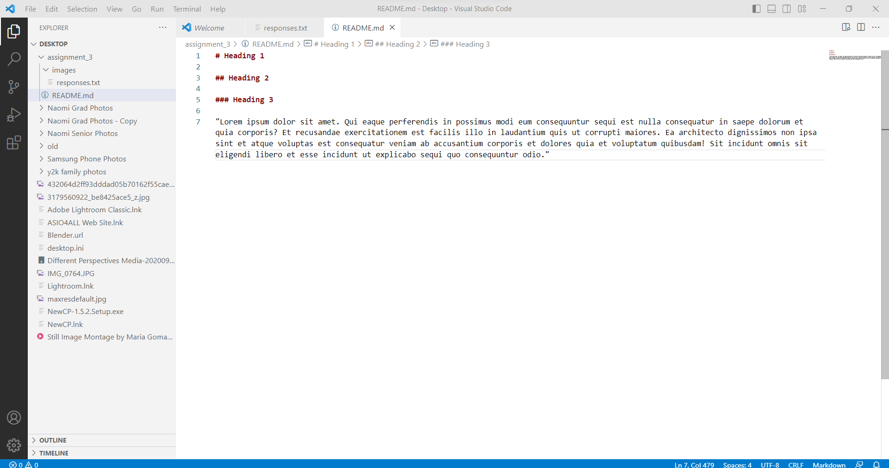

# Heading 1

## Heading 2

### Heading 3

1. So far, I learned that directories are hierarchical. There's a **root** directory, and below that are **subdirectories**. The web uses familial terms and calls their directories "grandparent/parent/child" according to their respective roles. I also learned that **HTML** and **Markdown** are one of the main languages used for Web development, HTML being the most common. I knew that web design can be complex, but I didn't realize there were so many steps. For instance, **README's** are texts that give information about a directory. I never knew what a README was until recently. There is a lot of scrupulous details that go into Web design.

[My File](./responses.txt) 

 